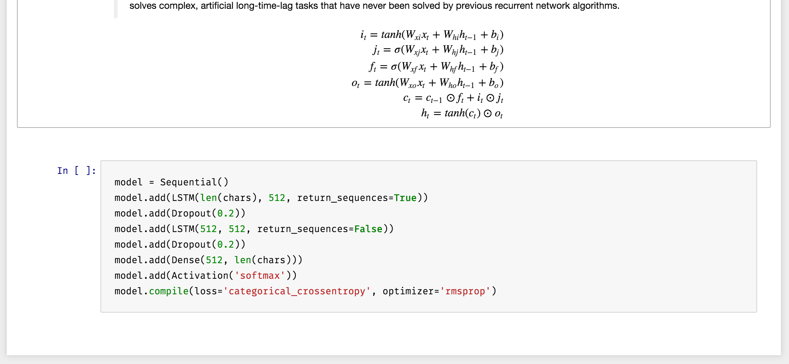
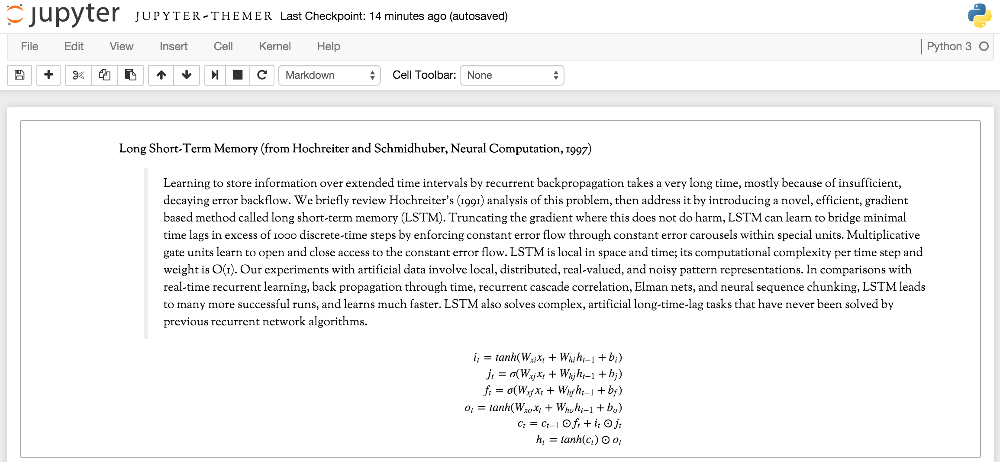
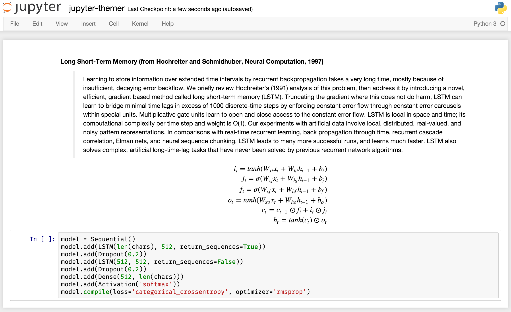

# jupyter-themer

Apply custom CSS styling to your jupyter notebooks.

Mix and match themes by:

- layout (example: `wide`)



- typography (example: `serif`)



- color (example: `night`)


You can always revert back to the default:



### Installation

```sh
pip install jupyter-themer
```

or

```sh
python setup.py install
```

### Usage

```sh
usage: jupyter-themer [-c COLOR, --color COLOR]
                      [-l LAYOUT, --layout LAYOUT]
                      [-t TYPOGRAPHY, --typography TYPOGRAPHY]
```

If no arguments are supplied, the program will revert the jupyter notebook style back to default.

One, two, or all three style types can be specified, and the program will mix together the associated color/layout/typographic css files accordingly, writing it to the `custom.css` file used by the notebook.

For all running notebooks, a quick browser refresh will be needed to apply the stylesheet.

### Available themes

##### `-c, --color`

- `3024-day`
- `3024-night`
- `abcdef`
- `ambiance`
- `base16-dark`
- `base16-light`
- `blackboard`
- `cobalt`
- `colorforth`
- `dracula`
- `eclipse`
- `elegant`
- `erlang-dark`
- `icecoder`
- `lesser-dark`
- `liquibyte`
- `material`
- `mbo`
- `mdn-like`
- `midnight`
- `monokai`
- `neat`
- `neo`
- `night`
- `paraiso-dark`
- `paraiso-light`
- `pastel-on-dark`
- `rubyblue`
- `seti`
- `solarized`
- `the-matrix`
- `tomorrow-night-bright`
- `tomorrow-night-eighties`
- `ttcn`
- `twilight`
- `vibrant-ink`
- `xq-dark`
- `xq-light`
- `yeti`
- `zenburn`

##### `-l, --layout`

- `wide`

##### `-t, --typograhy`

- `serif`

### License

MIT License
